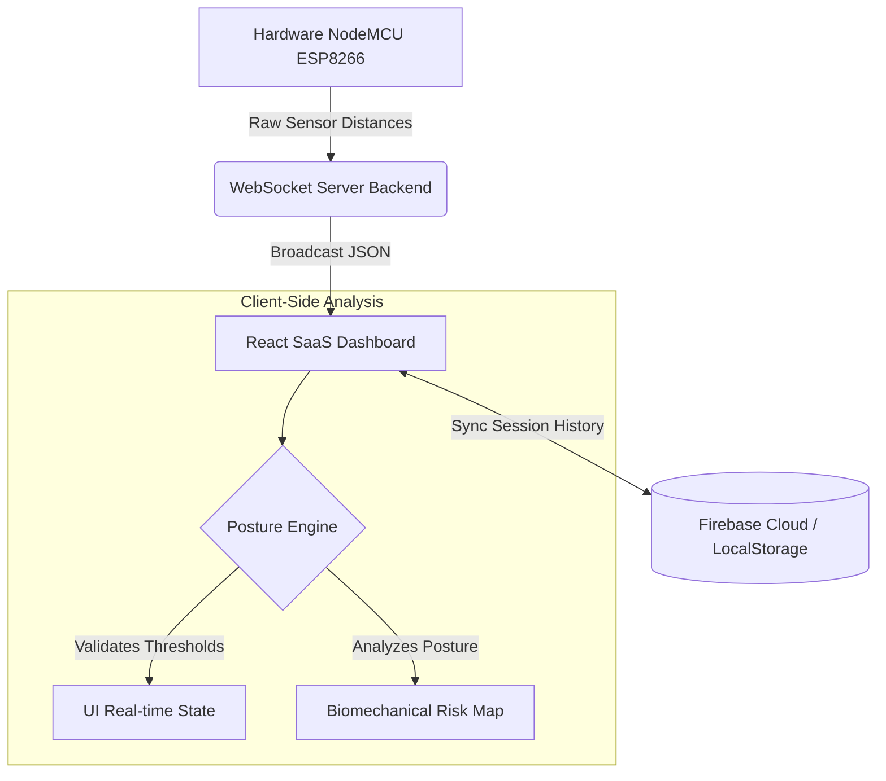

# 🌟 Aura-Sit

> A comprehensive, True IoT customized posture-monitoring ecosystem bridging custom hardware with a highly responsive, analytical SaaS dashboard.

Aura-Sit is designed to map real-time human mechanics to actionable health intelligence. By employing a NodeMCU microcontroller streaming raw distance data via Wi-Fi securely over WebSockets, we eliminate serialized tethers and create an ambient sensor ecosystem.

---

## 🚀 Key Innovations

*   **Decentralized Posture Engine:** A custom-built AI ruleset (`usePostureEngine.js`) running entirely inside the user's web browser, ensuring zero-latency calculations and 100% data privacy.
*   **Ergonomic Activity Index:** Actively tracks user micro-adjustments (>1.5cm shifts) to encourage dynamic "active sitting" rather than static freezing.
*   **Time-to-Fatigue Profiling:** Intelligently tracks the specific endurance of a user, predicting when muscles typically fatigue and degrade into postural compression.
*   **Biomechanical Risk Mapping:** Translates abstract numeric thresholds into anatomical risk factors (e.g., *Cervical Spine Strain* vs *Lumbar Compression*).
*   **True IoT Architecture:** Enforces Device Pairing signatures (e.g., `AURA-X792`), preventing data overlap and securing streams in multi-user environments.

---

## 🏗️ System Architecture



---

## 🛠️ Technology Stack

| Domain | Technologies |
| :--- | :--- |
| **Frontend** | React, Vite, Custom CSS, html2canvas (Reports) |
| **Backend / Bridge** | Node.js, Express, `ws` (WebSockets) |
| **Hardware / IoT** | NodeMCU ESP8266, Distance Sensors, C++ |
| **Database** | Firebase Firestore (Cloud Sync) |
| **Deployment** | Vercel (Frontend), Render (Backend) |

---

## 📁 Repository Structure

*   **/hardware** - C++ firmware flashed to the NodeMCU to process sensor signals and broadcast over Wi-Fi.
*   **/backend** - Node.js WebSocket relay server acting as the IoT bridge. It takes raw signals and relays them to connected clients.
*   **/frontend** - The React dashboard application. Contains the posture calculation engine, analytical components, historical logs, and visual export systems.

---

## 🚦 Running Locally

The dashboard involves two independent environments operating simultaneously.

### 1. Start the IoT Bridge (Backend)
The backend acts as the relay between the hardware sensors and the web interface.
```bash
cd backend
npm install
node virtual-device.js    # Starts the local virtual sensor array for testing/simulation
```

### 2. Start the Reporting Dashboard (Frontend)
The frontend houses the UI components and the decentralized posture engine.
```bash
cd frontend
npm install
npm run dev
```

> **Note:** To see the Live Analytics, ensure the Data Source is set to "LIVE" in the UI and your physical hardware Device ID matches the one input in the Dashboard settings.

---

## 🔮 Future Enhancements
*   **Full Authentication System:** Support for robust cloud synchronization for individual profiles.
*   **ML Integration:** Refining the rule-based Posture Engine into a neural network that adapts per user based on daily trends.
*   **Mobile Companion App:** React Native extension for passive push notifications and rapid reporting.
